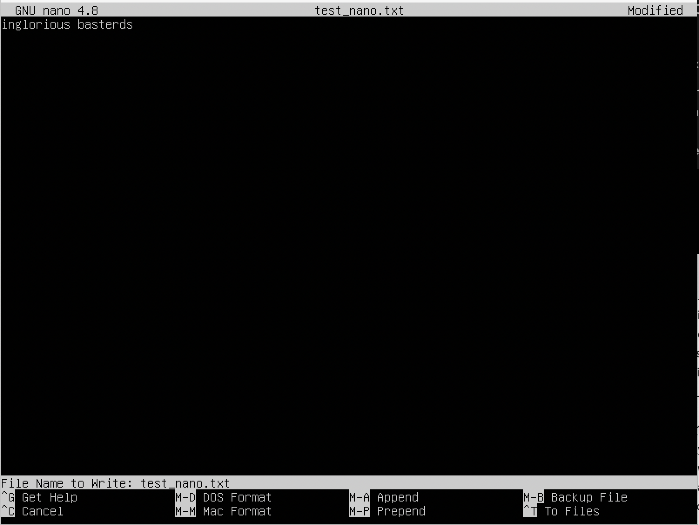
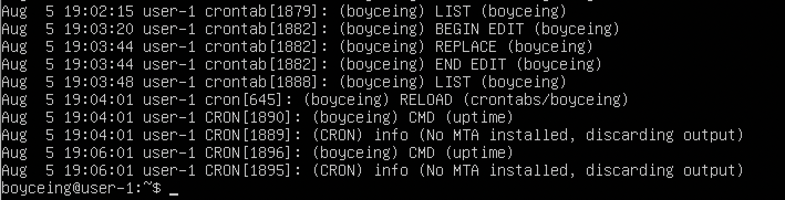

- [Part 1. Установка ОС](#part-1-установка-ос)
- [Part 2. Создание пользователя](#part-2-создание-пользователя)
- [Part 3. Настройка сети ОС](#part-3-настройка-сети-ос)
- [Part 4. Обновление ОС](#part-4-обновление-ос)
- [Part 5. Использование команды sudo](#part-5-использование-команды-sudo)
- [Part 6. Установка и настройка службы времени](#part-6-установка-и-настройка-службы-времени)
- [Part 7. Установка и использование текстовых редакторов](#part-7-установка-и-использование-текстовых-редакторов)
- [Part 8. Установка и базовая настройка сервиса SSHD](#part-8-установка-и-базовая-настройка-сервиса-sshd)
- [Part 9. Установка и использование утилит top, htop](#part-9-установка-и-использование-утилит-top-htop)
- [Part 10. Использование утилиты fdisk](#part-10-использование-утилиты-fdisk)
- [Part 11. Использование утилиты df](#part-11-использование-утилиты-df)
- [Part 12. Использование утилиты du](#part-12-использование-утилиты-du)
- [Part 13. Установка и использование утилиты ncdu](#part-13-установка-и-использование-утилиты-ncdu)
- [Part 14. Работа с системными журналами](#part-14-работа-с-системными-журналами)
- [Part 15. Использование планировщика заданий CRON](#part-15-использование-планировщика-заданий-cron)

## Part 1. Установка ОС

 "Рисунок №1. Версия OC")
>Рисунок №1. Версия OC.

## Part 2. Создание пользователя

>Рисунок №2. Вызов команды для создания пользователя.

>Рисунок №3. Вызов и вывод команды "cat /etc/passwd".

## Part 3. Настройка сети ОС
1. Задать имя хоста.

>Рисунок №4. Имя хоста".

2. Установить временную зону, соответствующую вашему местоположению.

>Рисунок №5. Временная зона".

1. **Интерфейс lo** - это виртуальная сетевая карта с адресом localhost (127.0.0.1).  Предназначен для сетевого доступа к своему же компьютеру. Он может быть использован сетевым клиентским программным обеспечением, чтобы общаться с серверным приложением, расположенным на том же компьютере. Этот механизм работает без какого-либо активного подключения, поэтому он полезен для тестирования служб, не подвергая их безопасность риску, как при удаленном сетевом доступе. Сетевой интерфейс — физическое или виртуальное устройство, предназначенное для передачи данных между программами через компьютерную сеть. Определен моделью TCP/IP.

2. **DHCP (Dynamic Host Configuration Protocol)** — протокол динамической настройки узла. Прикладной протокол, позволяющий сетевым устройствам автоматически получать IP-адрес и другие параметры, необходимые для работы в сети TCP/IP

3. Вывести Внешний ip-адрес шлюза (ip) и внутренний IP-адрес шлюза, он же ip-адрес по умолчанию (gw).

>Рисунок №7. Вывод внешего ip-адрес шлюза и внутреннего IP-адрес шлюза спомощью команды "ip r".

>Рисунок №8. Вывод внешего ip-адрес шлюза и внутреннего IP-адрес шлюза спомощью команды "ifconfig".

6. Задаем статичные настройки ip, gw, dns.

>Рисунок №9. Задаем статичные настройки ip, gw, dns.

- После редактирования настроек, применяем их с помощью команды "netplan try"/"netplan apply". Если ошибок нет, будет выведено предложение применить новые настройки.

>Рисунок №10.Настройки после перезагрузки.

7. Пингуем удаленные хосты.

>Рисунок №11. Пингуем 1.1.1.1.

>Рисунок №12. Пингуем ya.ru.

## Part 4. Обновление ОС

>Рисунок №13. Проверка наличия обновлений с помощью команды "sudo apt upgrade".

## Part 5. Использование команды sudo

 1. Объяснение назначения команды "sudo".
  - Команда sudo (substitute user and do, подменить пользователя и выполнить) позволяет строго определенным пользователям выполнять указанные программы с административными привилегиями без ввода пароля суперпользователя root. Если быть точнее, то команда sudo позволяет выполнять программы от имени любого пользователя, но, если идентификатор или имя этого пользователя не указаны, то предполагается выполнение от имени суперпользователя root. Таким образом, использование sudo позволяет выполнять привилегированные команды обычным пользователям без необходимости ввода пароля суперпользователя root . 
2. Изменение hostname от имени new_user

>Рисунок №14. Вызов и вывод команды hostname.

## Part 6. Установка и настройка службы времени

>Рисунок №15. вывод времени с помощью команды "date".

>Рисунок №16. вывод времени с помощью команды "timedatectl".

>Рисунок №17. Настройка службы автоматической синхронизации времени NTP".

## Part 7. Установка и использование текстовых редакторов

 1. Выход и сохранение:
 - Выход из vim и сохранение: "esc", ":wq".
 - Выход из nano и сохранение: "ctrl+X", "Save modified buffer? Y".
 - Сохранение и выход из mcedit: esc - yes.

>Рисунок №18. Vim, имя".

>Рисунок №19. Nano, имя".

>Рисунок №20. Mcedit, имя".

1. выход без сохранения изменений:
- vim: ":q!"
- выход без сохранения изменений nano: "ctrl+X", "Save modified buffer? N".
- выход без сохранения изменений mcedit: esc - no.

>Рисунок №21. Vim, изменение содержимого файла".

>Рисунок №22. Nano, изменение содержимого файла".

>Рисунок №23. Mcedit, изменение содержимого файла".

3. Поиск по содержимому файла (слово) и замены слова на любое другое.
- vim: поиск: "/*слово*", поиск с заменой: ":s/*слово*/*замена*/g"
- nano: поиск: "ctrl + W", поиск с заменой: "ctrl + |".
- mcedit: поиск F7, замена F4.

>Рисунок №27. Vim, замена слова".

>Рисунок №28. Nano, замена слова".

>Рисунок №29. Mcedit, замена слова".

## Part 8. Установка и базовая настройка сервиса SSHD
1. Установить службу SSHd.
- Для установки необходимо установить SSH или Secure Shell - это протокол безопасного доступа из одного компьютера к другому по сети. Выполняется с помощью команды "sudo apt install openssh-server".
2. Добавть автостарт при загрузке системы.
- Для того, чтобы служба запускалась автоматически нужно добавить его в автозагрузку. Для этого необходимо выполнить команду:"sudo systemctl enable ssh.service".
3. Перенастроить службу SSHd на порт 2022.

>Рисунок №30. Редактирование "sshd_config" для замены порта.

4. Использование команды "ps" для демонстрации наличия sshd.

>Рисунок №31. Выполнение команды "ps".

PID(712)TTY(?)STAT(SS)TIME(0:00)MAJFL(0)TRS(0)DRS(12172)RSS(6952)MEM(0.3)
- RSS - Физическая память без подкачки, которую использовала задача (в килобайтах).
- DRS - Память выделенная для не исполняемого кода.
- TRS - Память выделенная для исполняемого кода.
- MAJFL - Количество основных ошибок, которые произошли с этим процессом.
- STAT -  Многосимвольное состояние процесса.

- Команда **ps** используется для отображения текущих запущенных процессов и отображения информации об этих процессах. Процесс Linux - это экземпляр программы, запущенный в памяти. Все процессы можно разделить на обычные и фоновые. Linux - это многопользовательская система, каждый пользователь может запускать одни и те же программы, и даже один пользователь может захотеть запустить несколько экземпляров одной программы, поэтому ядру нужно как-то идентифицировать такие однотипные процессы. Для этого каждому процессу присваивается PID (Proccess Identificator).
- Опция **"a"** указывает ps вывести на дисплей процессы всех пользователей, за исключением тех процессов, которые не связаны с терминалом и процессами группы лидеров (вместе с -x).

- Опция **"x"** в ps перечисляет процессы без управляющего терминала. В основном это процессы, которые запускаются во время загрузки и работают в фоновом режиме.
- Опция **"f"** выдает такие колонки:
  - UID - пользователь, от имени которого запущен процесс;
  - PID - идентификатор процесса (712);
  - PPID - идентификатор родительского процесса;
  - C - процент времени CPU, используемого процессом;
  - STIME - время запуска процесса;
  - TTY - терминал, из которого запущен процесс (?);
  - TIME - общее время процессора, затраченное на выполнение процессора (0:00);
  - CMD - команда запуска процессора;
  - LWP - показывает потоки процессора;
  - PRI - приоритет процесса.

- Опция **"v"** . Display virtual memory format.

5. Перезагрузка системы.

>Рисунок №32. Выполнение команды "netstat-tan".

- Команда netstat, входящая в стандартный набор сетевых инструментов UNIX, отображает различную network–related информацию, такую как сетевые подключения, статистику интерфейсов, таблицы маршрутизации, masquerade, multicast, и т.п.
  - Опция **"a"**. Перечислить все порты. 
  - Опция **"a + t"** все TCP порты.
  - Опция **"n"**. Для вывода значений в цифровом формате. Команда покажет IP-адрес вместо хоста, номер порта вместо имени порта, UID вместо имени пользователя.

- Вывод: 
  - Proto - Протокол (tcp, udp, raw), используемый сокетом.
  - Recv-Q - Счётчик байт не скопированных программой пользователя из этого сокета.
  - Send-Q - Счётчик байтов, не подтверждённых удалённым узлом.
  - Local Address - Адрес и номер порта локального конца сокета. Если не указана опция --numeric (-n), адрес сокета преобразуется в каноническое имя узла (FQDN), и номер порта преобразуется в соответствующее имя службы.
  - Foreign Address - Адрес и номер порта удалённого конца сокета. Аналогично "Local Address."
  - State. Состояние сокета. Поскольку в режиме raw нет состояний, а в режиме UDP состояния обычно не испольуются, эта колонка может оставаться пустой. В данном случае LISTEN: cокет ожидает входящих подключений. Такие сокеты не включаются в вывод, пока вы не укажете опцию --listening (-l) или --all (-a).

-  Значение 0.0.0.0. 
Для обеспечения сетевых коммуникаций используются сокеты. Сокет это конечная точка сетевых коммуникаций. Каждый использующийся сокет имеет тип и ассоциированный с ним процесс. Сокеты существуют внутри коммуникационных доменов. Домены это абстракции, которые подразумевают конкретную структуру адресации и множество протоколов, которое определяет различные типы сокетов внутри домена. В Internet домене сокет - это комбинация IP адреса и номера порта, которая однозначно определяет отдельный сетевой процесс во всей глобальной сети Internet. Два сокета, один для хоста-получателя, другой для хоста-отправителя, определяют соединение для протоколов, ориентированных на установление связи, таких, как TCP. Пространство адресов протокола IPv4 начинается с 0.0.0.0 и простирается до 255.255.255.255. IP-адрес 0.0.0.0 — это немаршрутизируемый адрес IPv4, который можно использовать в разных целях, в основном, в качестве адреса по умолчанию или адреса-заполнителя. Несмотря на то, что адрес 0.0.0.0 может использоваться в компьютерных сетях, он не является адресом какого-либо устройства. В локальной сети. В локальной сети адрес 0.0.0.0 можно использовать в качестве адреса источника в широковещательной передаче IPv4, которая используется для передачи данных на все устройства в локальной сети. На серверах. IP-адрес 0.0.0.0 может использоваться на серверах для обозначения того, что служба может связываться со всеми сетевыми интерфейсами. Он дает команду серверу «прослушивать» и принимать соединения с любого IP-адреса.

## Part 9. Установка и использование утилит top, htop
 1. Команда "top".
 
 
>Рисунок №33. Вывод команды "top".

- uptime: 2 мин.
- количество авторизованных пользователей: 1 user
- общая загрузка системы: Load average 0.38 0.39 0.17
- общее количество процессов: 103 total, 1 running, 102 sleeping, 0 stopped, 0 zombie

- загрузка cpu: 
   - us — пользовательские процессы (высокое значение данного показателя может указывать, в том числе, на проблемы в коде сайта, необходимость его оптимизации): 0.0.
   - sy — процессы ядра: 0.0.
   - id — неиспользуемые ресурсы: 100.0.
   - wa — операции ввода/вывода, т.е. дисковые операции: 0.0.

- загрузка памяти:
   - Mem: 1983.4 total 1506.7 free, 147.0 used, 329.7 buff/cache
   - Swap: 1738 total, 1738.0 free, 0.0 used, 1687.5 avail Mem

- pid процесса занимающего больше всего памяти: 657
- pid процесса, занимающего больше всего процессорного времени: 1

1. Команда "htop".

 
>Рисунок №34. Процессы, отсортированные по PID.

 
>Рисунок №35. Процессы, отсортированные по PERCENT_CPU.

 
>Рисунок №36. Процессы, отсортированные по PERCENT_MEM.

 
>Рисунок №37. Процессы, отсортированные по TIME.

 
>Рисунок №38. Htop для процесса sshd.

 
>Рисунок №39. Htop с процессом syslog, найденным, используя поиск.

 
>Рисунок №40. Htop с добавленным выводом.

## Part 10. Использование утилиты fdisk

 
>Рисунок №41. Вывод fdisk.
- Название жесткого диска: /dev/sda
- Disk model: VBOX HARDDISK
- Pазмер и количество секторов: 10 Gb, 20971520 sectors
- Pазмер swap: 10737418240

## Part 11. Использование утилиты df
 
 
>Рисунок №43. Вывод df-Th.

 1.  "df" Для корневого раздела (/):
   - размер раздела: 9299276.
   - размер занятого пространства: 4371560.
   - размер свободного пространства: 4433740.
   - процент использования: 50%.
   - Единица измерения в выводе: KB (Килобайт).

2. Командa df -Th для корневого раздела (/):
 
 
>Рисунок №43. Вывод df-Th.

- размер раздела: 8.9G
- размер занятого пространства: 4.2G
- размер свободного пространства: 4.3G
- процент использования: 50%
- Тип файловой системы для раздела:ext4

## Part 12. Использование утилиты du
- Опция "h", --human-readable - выводить размер в единицах измерения удобных для человека;
- Опция "a", --all - выводить размер для всех файлов, а не только для директорий, по умолчанию размер выводится только для папок;
 
 
>Рисунок №44. du для папки /home.

 
>Рисунок №45. du для папки /var.

 
>Рисунок №46. du для папки /var/log.

 
>Рисунок №47. du -ha для папки /var/log/*.

 
>Рисунок №48. du -ha для папки /var/log/*.

## Part 13. Установка и использование утилиты ncdu

 
>Рисунок №49. ncdu -ha для папки /home.

 
>Рисунок №50. ncdu -ha для папки /var.

 
>Рисунок №51. ncdu -ha для папки /var/log.

## Part 14. Работа с системными журналами

 
>Рисунок №52. Время последнего успешного входа в систему, имя пользователя и способ входа в систему.

- Время последней успешной авторизации: Aug 5 18.01.55
- Имя пользователя: boyceing
- Метод входа в систему: by LOGIN

 
>Рисунок №53. Информация из файла /var/log/syslog, показывающий сообщение о перезапуске службы SSHd.

## Part 15. Использование планировщика заданий CRON 

1. Cписок текущих заданий для CRON.

 
>Рисунок №54. CRON список задач.

2.  Cтрочки о выполнении и список текущих задач в /var/log/syslog.

 
>Рисунок №55. Системный журнал, выполнение "uptime".

3. Удаление заданий из планировщика заданий.

 
>Рисунок №56. Просмотр журнала после удаления.